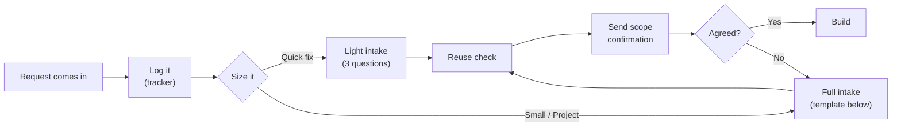

# 01 · Intake & Scoping ★

> **Purpose:** Turn every request into a clearly defined, agreed-upon deliverable before I start building.
> **When to use:** Any time someone asks for a new report, metric, change, or "quick pull."
> **Related:** [Role Expertise Map](../role-expertise-map.md) · [03 Report Design](../03-report-design/) · [04 Validation & QA](../04-validation-qa/)
> **Last reviewed:** YYYY-MM-DD

---

## Principles

1. **Find the decision, not just the deliverable.** "I need a dashboard" is a request. "I need to know which regions to cut spend in" is the need. Build for the need.
2. **Scope before SQL.** Ten minutes of questions saves days of rework.
3. **Match the effort to the size.** A two-hour fix doesn't need a full intake, but a new semantic model does.
4. **Reuse before building.** Check whether an existing report, model, or measure already answers the question.
5. **Get agreement in writing.** A short confirmation note prevents "that's not what I asked for."
6. **Define "correct" up front.** Ask what number the result should match. That becomes the QA baseline.

---

## The intake flow



---

## Step 1 · Log it

Every request goes in the tracker, even small ones, before any work starts. Record who asked, the date, and a one-line summary in their words.

---

## Step 2 · Size it

| Size | Rough effort | Examples | Intake depth |
|---|---|---|---|
| **Quick fix** | < 2 hours | Add a filter, fix a label, one-off number | Light intake (3 questions) |
| **Small** | ≤ 2 days | New page on existing report, new measure, modified visual | Full intake template |
| **Project** | > 2 days | New report, new semantic model or Dataflow, new data source | Full intake template + kickoff conversation |

**Light intake: the three questions**
1. What are you trying to decide or answer?
2. When do you need it, and what happens if it's later?
3. Is there a number this should match?

> If a "quick fix" touches the data model, a shared measure, or a monthly report, treat it as **Small**. Changes there ripple.

---

## Step 3 · Run the intake

Use the template below for Small and Project requests. You don't need every answer. Gaps are fine, but know which ones you're guessing on.

### Intake template

```markdown
## Request: [Short name]
**Requested by:** 
**Date received:** 
**Size:** Quick fix / Small / Project

### The need
- What decision or action will this support?
- What question should the report answer at a glance?
- What happens today without it? (workaround, manual process, gut feel)

### The audience
- Who will view it? 
- Audience type: Executive | Manager-Operator | Analyst (see 03-report-design)
- How often will they look at it? (daily / weekly / monthly / one-time)

### The metrics
- Which metrics are needed? (use the metric definition block for each new one)
- What breakdowns or filters? (region, product, time period, etc.)
- What time range and comparison? (MTD, YTD, vs. prior year, vs. target)

### The data
- Source systems / tables:
- Existing semantic model or Dataflow that covers this? Y / N / Partial
- How often does the source update? How fresh does the report need to be?
- Known data quality issues?

### Definition of correct
- What trusted number should this reconcile to? (finance report, source system, prior report)
- Who can confirm the numbers are right?

### Timeline & priority
- Needed by: 
- Hard deadline or preference? Why?
- What else does this compete with?

### Out of scope
- What are we explicitly NOT doing in this version?

### Open questions / assumptions
- 
```

### Metric definition block

Use this for every **new** metric. Add finalized definitions to the metric definitions log.

```markdown
**Metric name:** 
**Business meaning (plain English):** 
**Calculation:** 
**Grain:** (per order / per customer / per day…)
**Filters & exclusions:** (e.g., excludes returns, internal accounts, test data)
**Time logic:** (order date vs. ship date vs. invoice date; fiscal vs. calendar)
**Source:** 
**Owner (who decides if it's right):** 
**Edge cases:** (nulls, zero, negatives, partial periods)
```

---

## Step 4 · Reuse check

Before building, ask these in order:

- [ ] Does an existing report already answer this, maybe with a filter or bookmark?
- [ ] Does an existing semantic model contain the data and measures I need?
- [ ] Does an existing Dataflow already produce the tables I need?
- [ ] Is there an existing measure with the same or a similar name? If so, is it the same definition?
- [ ] Is this a variant of a recent request from someone else? Could one deliverable serve both?

> Two measures with the same name and different logic is one of the fastest ways to lose stakeholder trust. When definitions conflict, resolve them before building.

---

## Step 5 · Send the scope confirmation

After intake, send a short note and get a "yes" before building. Keep it to what fits on a phone screen.

```markdown
Hi [Name] — confirming what I'll build so we're aligned:

**Goal:** [the decision/question it supports]
**Deliverable:** [new report / new page / measure / one-off number]
**Includes:** [key metrics, breakdowns, time range]
**Not included (for now):** [out-of-scope items]
**Numbers will reconcile to:** [trusted source]
**Target date:** [date] — [any dependency, e.g., "assuming source data lands by the 5th"]

Let me know if anything's off. Otherwise I'll get started.
```

---

## Prioritizing competing requests

When several requests land at once, sort by **impact** and **urgency**:

| | **Urgent** | **Not urgent** |
|---|---|---|
| **High impact** | Do now | Schedule it |
| **Low impact** | Quick win or negotiate the date | Backlog or decline |

- Recurring monthly reporting deadlines come first unless my manager says otherwise.
- If two stakeholders both claim top priority, escalate to my manager instead of choosing silently.
- "Everything is urgent" means I ask: *"If I can only deliver one of these this week, which one?"*

---

## Handling scope changes

Requests grow mid-build. When they do:

1. **Acknowledge it:** "Good idea. That's a change from what we scoped."
2. **Size the impact:** How much time does it add? Does it touch the model?
3. **Offer the trade-off:** "I can add it and move the date to X, or deliver as scoped by Y and add it in version 2."
4. **Update the confirmation:** Reply on the original scope note so there's one record.

---

## Red flags during intake

| Red flag | What to do |
|---|---|
| "Just show me everything" | Ask what they'd do differently based on what they see. Build for that. |
| No one can say what "correct" looks like | Find a trusted number first, or flag the risk in the scope note. |
| The metric means different things to different teams | Resolve the definition with both owners before building. |
| Request comes secondhand ("my boss wants…") | Try to talk to the actual end user, or confirm the need with the requester. |
| Deadline is tomorrow for a Project-sized request | Offer a smaller first version that meets the deadline. |
| Data source is new or unfamiliar | Budget time to profile the data before committing to a date. |

---

## Definition of done (for the intake stage)

Intake is complete when:

- [ ] The request is logged and sized
- [ ] I can state the decision it supports in one sentence
- [ ] The audience type is identified
- [ ] New metrics have written definitions
- [ ] The reuse check is done
- [ ] A reconciliation baseline is named (or the gap is flagged)
- [ ] The stakeholder confirmed scope and date in writing

---

## Lessons
<!-- One line per lesson, newest first. Format: YYYY-MM-DD — what happened → what I'll do differently -->
