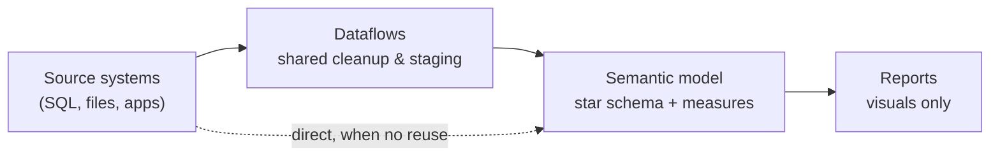

# 02 · Data Modeling

> **Purpose:** Build Dataflows, Power Query transformations, and semantic models that are correct, consistent, and easy to maintain.
> **When to use:** Creating or changing a Dataflow, Power Query logic, a semantic model, or DAX measures.
> **Related:** [01 Intake & Scoping](../01-intake-scoping/) · [04 Validation & QA](../04-validation-qa/) · [Role Expertise Map](../role-expertise-map.md)
> **Last reviewed:** YYYY-MM-DD

---

## Principles

1. **Push logic upstream when you can.** Transform as far upstream as possible and as far downstream as necessary. (This is known as "Roche's Maxim.") Reusable cleanup belongs in the Dataflow or source, not repeated in every model.
2. **Star schema by default.** Build fact tables for events and numbers, and dimension tables for the things you filter and group by. Most Power BI problems trace back to a model that isn't a star.
3. **Explicit measures only.** Every number in a report comes from a named DAX measure, not a dragged-in column.
4. **One definition per metric.** If a measure exists, reuse it. If two versions are needed, name them differently and document why.
5. **Name for the report user.** Anything visible in the field list should make sense to someone who's never seen the source system.
6. **Leave a trail.** Future me should understand what each model does and why it changed.

---

## The layers



### Where does the logic belong?

| Type of logic | Put it in… | Why |
|---|---|---|
| Cleanup used by several models (type fixes, trimming, standard mappings) | **Dataflow** | Write once and reuse everywhere. |
| Heavy filtering or joins on large tables | **Source (SQL view/query)** or Dataflow | Keeps refresh fast, and folding is more likely. |
| Model-specific shaping (renaming, removing columns, building dimensions) | **Power Query in the semantic model** | Keeps the Dataflow generic. |
| Row-level attributes used to slice or filter (e.g., age band, region group) | **Power Query column** (preferred) or calculated column | Computed at refresh and filterable. |
| Aggregations, ratios, time comparisons | **DAX measure** | Responds to filters. It can't be precomputed. |
| Formatting, colors, titles | **Report** | Presentation only, never business logic. |

> **Rule of thumb:** If the answer changes when someone clicks a slicer, it's a measure. If it doesn't, it's a column, so build it upstream.

---

## Power Query standards

**Structure**
- Split queries into **staging** (raw pull, minimal changes, load disabled) and **final** (shaped tables that load to the model).
- Use **parameters** for server names, database names, and date cutoffs. Never hardcode them in multiple places.
- Remove unneeded columns and rows **early** to keep refresh fast.

**Step naming**
- Rename every step that isn't self-explanatory. `Filtered Rows 3` tells you nothing. `Filter to active customers` tells you what happened.
- Add a comment to any step with non-obvious business logic: right-click the step → Properties → Description.

**Query folding**
- Folding pushes steps back to the source as a query, which is much faster on large tables.
- Check it: right-click a step → **View Native Query** (greyed out usually means folding stopped). In Dataflows, watch the step folding indicators.
- Do foldable steps (filter, remove columns, basic joins) **before** steps that break folding (custom columns with complex M, index columns, some merges).

**Data types**
- Set data types explicitly as a final step, and don't rely on auto-detection from the first rows.
- Watch for text-formatted numbers and dates coming from Excel or CSV sources.

---

## Dataflow standards

- Use a Dataflow when **two or more models** need the same cleaned table, or when the source is slow and should be pulled once.
- Keep Dataflows **generic**: clean and standardize, but leave report-specific shaping to the model.
- Name Dataflows by **source or subject** (e.g., `DF - ERP Sales`, `DF - HR Employees`), not by the report that first used them.
- Record the **refresh schedule** and upstream dependency in the model register below. Monthly reporting depends on this timing.
- When a Dataflow changes, check **every model that uses it** before publishing.

---

## Semantic model standards

**Star schema**
- **Fact tables:** events and transactions with numeric values and foreign keys (e.g., Sales, Orders, Tickets).
- **Dimension tables:** descriptive attributes you slice by (e.g., Customer, Product, Date, Region).
- Avoid wide, flat "everything" tables and snowflaked chains of dimensions where you can.

**Relationships**
- Default to **one-to-many, single direction**, from dimension to fact.
- Use bidirectional filtering only with a specific reason, and write that reason down.
- Avoid many-to-many relationships. They usually signal a missing bridge or dimension table.
- Check for **blank rows** in dimensions. They mean fact rows have keys that don't match.

**Date table**
- Every model gets a dedicated **Date table**: continuous dates, covering the full data range, and **marked as a date table**.
- Turn off **Auto date/time** (File → Options → Data Load).
- Include the fiscal columns the business actually uses (fiscal year, fiscal month, period labels).

**Field list hygiene**
- Hide foreign keys and technical columns in fact tables.
- Set **Summarize by: None** on ID and numeric attribute columns (like year or account number).
- Group measures in a dedicated **measures table** or in **display folders**.
- Add **descriptions** to tables, key columns, and measures. They show as tooltips in the field list.

---

## DAX standards

- Use **variables** (`VAR … RETURN`) to make logic readable and avoid repeated calculations.
- Use `DIVIDE(numerator, denominator)` instead of `/` to handle divide-by-zero safely.
- Build **base measures first** (e.g., `Sales Amount`), then build other measures on top of them (e.g., `Sales Amount PY`, `Sales YoY %`).
- Prefer **measures over calculated columns** for anything aggregated.
- Format every measure (currency, %, decimals) in the model, not visual by visual.
- Comment anything clever: `// Excludes internal accounts per Finance definition 2026-03`.

**Measure template**

```dax
Sales YoY % =
// Year-over-year change in Sales Amount. Requires marked Date table.
VAR CurrentSales = [Sales Amount]
VAR PriorSales   = [Sales Amount PY]
RETURN
    DIVIDE ( CurrentSales - PriorSales, PriorSales )
```

---

## Naming conventions

Pick a convention and apply it everywhere. The key is consistency, not the specific convention.

| Object | Convention | Example |
|---|---|---|
| Dataflow | `DFW_[Source/Subject]` | `DFW_ERPSales` |
| Semantic model | `[Subject] Model` | `Sales Model` |
| Staging query | `stg_[source]_[table]` (load disabled) | `stg_erp_orders` |
| Parameter | `p_[name]` | `p_ServerName` |
| Tables (visible) | Business name, singular or plural, stay consistent | `Sales`, `Customer`, `Date` |
| Columns (visible) | Business-friendly, with spaces | `Customer Name`, `Order Date` |
| Measures | `[Metric] [Modifier]` | `Sales Amount`, `Sales Amount PY`, `Sales YoY %` |
| Hidden helper measures | Prefix with `_` | `_Sales Base` |

---

## Model register

Keep a running record of every model and Dataflow I own. Store it here or in a separate `model-register.md`.

```markdown
| Name | Type | Sources | Used by (reports) | Refresh schedule | Owner/contact for source | Notes |
|---|---|---|---|---|---|---|
| DF - ERP Sales | Dataflow | ERP SQL | Sales Model, Ops Model | Daily 5:00 AM | | |
| Sales Model | Semantic model | DF - ERP Sales, Targets.xlsx | Monthly Sales, Exec Summary | Daily 6:00 AM | | |
```

### Source notes template

Use one per source system, and add to it as you learn quirks.

```markdown
## Source: [System name]
**What it is:** 
**Access / connection:** 
**Key tables & grain:** 
**Update timing:** (when data lands; month-end close timing)
**Known quirks:** (duplicates, late-arriving records, soft deletes, test data)
**Contact:** (who to ask when something looks wrong)
```

---

## Change log

Record meaningful model changes. It helps when numbers shift and someone asks why.

```markdown
| Date | Model / Dataflow | Change | Reason / request | Reports affected | QA done? |
|---|---|---|---|---|---|
```

---

## Before publishing a model: checklist

- [ ] Model is a star schema (or deviations are documented)
- [ ] Relationships are one-to-many, single direction (or exceptions are documented)
- [ ] Date table is marked, and Auto date/time is off
- [ ] No unexpected blank rows in dimensions
- [ ] Keys and technical columns are hidden
- [ ] All report numbers come from explicit, formatted measures
- [ ] New measures match their written definitions (see 01 metric definition block)
- [ ] Power Query steps are named, and staging queries don't load
- [ ] Refresh runs successfully in the Service, and duration is reasonable
- [ ] Downstream reports still work after the change
- [ ] Validation completed (see [04 Validation & QA](../04-validation-qa/))
- [ ] Model register and change log updated

---

## Common pitfalls

| Symptom | Likely cause | Fix |
|---|---|---|
| Totals don't match the sum of rows | Measure logic or filter context issue | Test the measure in a table visual, and check with DAX Studio. |
| Blank row appears in slicers | Fact keys with no matching dimension row | Find the unmatched keys, then fix them upstream or add an "Unknown" member. |
| Numbers are duplicated or inflated | Many-to-many join or duplicate keys in a dimension | Check the dimension key for uniqueness. |
| Refresh is slow | Folding broken early, or unneeded columns and rows loaded | Reorder steps, filter early, and check View Native Query. |
| Time intelligence returns blanks | Date table not marked, or not continuous | Mark the Date table, fill gaps, and relate it on a date column. |
| Same metric shows different values in two reports | Duplicate measures with different logic | Consolidate to one definition, and use a shared model if possible. |

---

## Tools

| Tool | Use it for |
|---|---|
| **Power BI Desktop** | Building models, Power Query, and DAX |
| **Tabular Editor** | Bulk edits, display folders, descriptions, and the Best Practice Analyzer |
| **DAX Studio** | Testing and debugging measures, query performance, and model size (VertiPaq Analyzer) |
| **Performance Analyzer** (in Desktop) | Finding slow visuals and measures |
| **SQL (SSMS / VS Code)** | Profiling sources and building upstream views |

---

## Learning resources

- Microsoft Learn: *Star schema guidance for Power BI*
- SQLBI (sqlbi.com): DAX patterns and data modeling articles
- Tabular Editor docs: Best Practice Analyzer rules

---

## Lessons
<!-- One line per lesson, newest first. Format: YYYY-MM-DD — what happened → what I'll do differently -->
