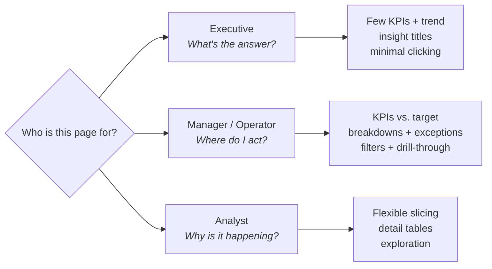

# 03 · Report Design ★

> **Purpose:** Build Power BI reports that fit the people viewing them, using a consistent standard so every report feels familiar and trustworthy.
> **When to use:** Designing a new report or page, redesigning an existing one, or reviewing a report before publishing.
> **Related:** [01 Intake & Scoping](../01-intake-scoping/) (audience type comes from intake) · [02 Data Modeling](../02-data-modeling/) · [04 Validation & QA](../04-validation-qa/)
> **Last reviewed:** YYYY-MM-DD

---

## Principles

1. **Design for one audience per page.** A page that tries to serve an executive and an analyst serves neither.
2. **Answer the main question first.** The most important number or insight goes top-left, where eyes land first.
3. **Every visual earns its spot.** If removing a visual wouldn't change a decision, remove it.
4. **Consistency builds trust.** Same colors, fonts, layout, and filter placement across every report I build.
5. **Color means something.** Use one highlight color for emphasis and consistent colors for good and bad. Everything else stays neutral.
6. **Make it self-explanatory.** Someone should understand the page without me in the room.

---

## Audience standard

The audience type is captured during [intake](../01-intake-scoping/). Each type gets its own design pattern.



### Summary

| | **Executive** | **Manager / Operator** | **Analyst** |
|---|---|---|---|
| **Core question** | "Are we on track?" | "Where do I need to act?" | "Why is this happening?" |
| **Time on page** | Under 1 minute | 5–10 minutes | As long as needed |
| **Visual budget** | 3–5 visuals | 6–8 visuals | Flexible, keep pages focused |
| **KPI cards** | 3–4 headline metrics | 4–6 metrics vs. target | Optional |
| **Detail level** | Summary only | Summary + ranked breakdowns + exception list | Row-level detail available |
| **Interactivity** | Minimal, few or no slicers | Key slicers, drill-through to detail | Many slicers, drill-down, field parameters |
| **Titles** | Insight titles ("Sales up 8% vs. PY") | Descriptive titles ("Sales by Region vs. Target") | Descriptive titles |
| **Text / annotation** | Short commentary on what changed | Brief notes on exceptions | Definitions and methodology |
| **Typical delivery** | App, email subscription, PDF export | App, Teams tab | App, Analyze in Excel |

---

### Executive pattern

**Goal:** Answer "are we on track?" at a glance, with context on what changed.

```
┌──────────────────────────────────────────────────────────┐
│ Report Title                        Last refreshed: date │
├─────────────┬─────────────┬─────────────┬────────────────┤
│  KPI card   │  KPI card   │  KPI card   │   KPI card     │
│  vs. target │  vs. target │  vs. PY     │   vs. PY       │
├─────────────┴─────────────┴──────┬──────┴────────────────┤
│                                  │                       │
│   Main trend (line chart)        │  Top breakdown        │
│   actual vs. target / PY         │  (bar chart)          │
│                                  │                       │
├──────────────────────────────────┴───────────────────────┤
│ Key takeaways: 2–3 short bullets on what changed and why │
└──────────────────────────────────────────────────────────┘
```

- Lead with **3–4 KPIs**, each shown with a comparison (target, prior period, or prior year).
- Use **insight titles** that state the takeaway, not just the chart contents.
- Keep slicers off the page, or limit to one (e.g., period). Execs rarely filter.
- Add a short **takeaways box** for monthly reports. Numbers without context invite follow-up emails.
- Check that it reads well as a **PDF or email subscription** image, since many execs never open the report.

---

### Manager / Operator pattern

**Goal:** Show performance against targets, and point to where attention is needed.

```
┌──────────────────────────────────────────────────────────┐
│ Report Title                        Last refreshed: date │
├──────────┬──────────┬──────────┬──────────┬──────────────┤
│ KPI      │ KPI      │ KPI      │ KPI      │  Slicers:    │
│ vs. tgt  │ vs. tgt  │ vs. tgt  │ vs. tgt  │  Period      │
├──────────┴──────────┴────┬─────┴──────────┤  Region      │
│                          │                │  Team        │
│  Trend vs. target        │ Ranked         │              │
│  (line / column)         │ breakdown      │  [Reset]     │
│                          │ (bar, sorted)  │              │
├──────────────────────────┴────────────────┴──────────────┤
│ Exceptions table: items off target, sorted by impact     │
│ (right-click → drill-through to detail)                  │
└──────────────────────────────────────────────────────────┘
```

- Show **KPIs vs. target** with conditional formatting for good and bad.
- Use **ranked, sorted bar charts** so the biggest issues rise to the top.
- Include an **exceptions table** listing what's off track. This is often the most-used visual.
- Place slicers in a **consistent spot** (right or top) with a **reset filters** button.
- Add **drill-through** to a detail page rather than cramming detail onto the main page.

---

### Analyst pattern

**Goal:** Let a data-comfortable user explore, slice, and find root causes.

- Provide **flexible slicers**, and consider **field parameters** so users can switch measures or dimensions.
- Include **matrix and table visuals** with drill-down, plus row-level detail pages.
- Add **tooltip pages** for context on hover.
- Include a **definitions page** so analysts know exactly how each measure works.
- Keep each page focused on one question. Flexible doesn't mean cluttered.

---

## Visual standards (all audiences)

### Choosing a chart

| If you want to show… | Use | Avoid |
|---|---|---|
| Change over time | Line chart (column for few periods) | Pie, area with many series |
| Comparison across categories | Bar chart, sorted | Pie with many slices, unsorted bars |
| Actual vs. target | Bullet-style bar, KPI card, line with target line | Gauges (take space, show one number) |
| Part-to-whole | Stacked bar, or pie/donut with **2–3 slices max** | Pie/donut with 5+ slices |
| Ranking | Sorted bar chart, top N | Tables without sorting |
| Relationship between two measures | Scatter plot | Dual-axis charts (easy to misread) |
| Single headline number | Card / KPI visual | Big tables |
| Exact values to look up | Table or matrix | Charts with data labels on everything |

### Layout

- Default canvas: **16:9 (1280 × 720)**.
- Reading order: **top-left → right → down**. The most important content goes top-left.
- Align visuals to a grid, with consistent spacing between visuals.
- Every page gets a **title** and a **"last refreshed" date**.
- Filters and slicers go in the **same position** on every page.

### Color

- Build from a **report theme file** (JSON) so colors are consistent and updated in one place.
- **One highlight color** for emphasis, and neutral grays for everything else.
- **Good / bad colors** are used only for performance meaning, and always the same way.
- Don't rely on color alone. Pair it with icons, labels, or arrows (roughly 1 in 12 men have some color-vision deficiency).

**Starter theme file** (`assets/report-theme.json`, then update the colors to match your brand):

```json
{
  "name": "Playbook Standard",
  "dataColors": ["#1F4E79", "#9DB4CC", "#F2A900", "#7F7F7F", "#BFBFBF", "#4A7FB0"],
  "background": "#FFFFFF",
  "foreground": "#252423",
  "tableAccent": "#1F4E79",
  "good": "#1A7F37",
  "neutral": "#F2A900",
  "bad": "#C62828"
}
```

### Text & numbers

- Fonts: keep the theme default (Segoe UI) unless there's a brand standard. Keep text at **12pt+** where possible and never below 10pt.
- Abbreviate large numbers (**$1.2M**, **45K**) on cards and charts, and show full precision in tables.
- Use a consistent decimal rule: **0 decimals** for currency over $1K, **1 decimal** for percentages.
- Axis titles only when units aren't obvious from the chart title.
- Remove chart junk: gridlines where not needed, borders, 3D, and redundant legends.

### Accessibility

- [ ] Text and background contrast is strong (aim for 4.5:1)
- [ ] Every visual has **alt text** describing what it shows
- [ ] **Tab order** follows the reading order (View → Selection pane → Tab order)
- [ ] Meaning is never shown by color alone

---

## Standard report components

Every report includes:

| Component | Purpose |
|---|---|
| **Title + last refreshed date** | Tells users what they're looking at and how current it is |
| **Reset filters button** (bookmark) | Easy return to the default view |
| **About / Info page** | Purpose, audience, data sources, refresh schedule, owner contact, metric definitions |
| **Consistent navigation** | Page buttons or tabs in the same spot on every page |
| **Tooltips on key visuals** | Context without clutter |

---

## Pre-publish design checklist

Run this after [04 Validation & QA](../04-validation-qa/) confirms the numbers are right.

**Audience fit**
- [ ] Each page has one clear audience type, matching the intake
- [ ] **5-second test:** the page's main message is clear within 5 seconds
- [ ] Visual count is within the audience budget

**Consistency**
- [ ] Theme file applied, and colors used per the standard
- [ ] Title, last refreshed date, and reset button present on every page
- [ ] Slicers and navigation in the standard position
- [ ] Number formats and decimals follow the rules

**Usability**
- [ ] Charts are sorted meaningfully (by value, not alphabetically, unless it's time or a natural order)
- [ ] Drill-through, tooltips, and bookmarks tested
- [ ] About page complete
- [ ] Accessibility checklist done
- [ ] Viewed in the **Service** (not just Desktop), and on **mobile / PDF** if the audience uses them

---

## Common pitfalls

| Pitfall | Fix |
|---|---|
| Page tries to answer too many questions | Split into multiple pages, or use drill-through. |
| Stakeholder asks for "everything" on one page | Go back to the intake question: what decision is this for? |
| Rainbow of colors with no meaning | Apply the theme, and use one highlight color. |
| Users don't notice filters are applied | Add a filter summary or reset button, and keep slicers visible. |
| Report looks great in Desktop, cramped in the Service | Always review the published version before sharing. |
| Execs email "what does this mean?" | Add insight titles and a takeaways box. |

---

## Report catalog

Track every report I own. Pairs with the model register in [02](../02-data-modeling/).

```markdown
| Report | Audience type | Primary users | Semantic model | Delivery | Cadence | Last redesign |
|---|---|---|---|---|---|---|
```

---

## Learning resources

- Microsoft Learn: *Power BI report design tips*
- *Storytelling with Data* by Cole Nussbaumer Knaflic (visual clarity and decluttering)
- SQLBI / Power BI community blogs for theme files and design patterns

---

## Lessons
<!-- One line per lesson, newest first. Format: YYYY-MM-DD — what happened → what I'll do differently -->
