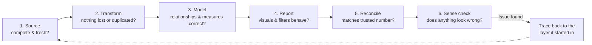

# 04 · Validation & QA ★

> **Purpose:** Prove the numbers are right before anyone else sees them, and catch issues at the layer where they start.
> **When to use:** Before publishing any new or changed Dataflow, model, or report, and during every monthly reporting cycle.
> **Related:** [01 Intake & Scoping](../01-intake-scoping/) (reconciliation baseline) · [02 Data Modeling](../02-data-modeling/) · [03 Report Design](../03-report-design/) · [05 Monthly Reporting](../05-monthly-reporting/)
> **Last reviewed:** YYYY-MM-DD

---

## Principles

1. **I find the errors before stakeholders do.** Every error a stakeholder finds costs trust that's slow to rebuild.
2. **Check at every layer.** An error caught at the source takes minutes to fix. The same error found in a published report takes days to untangle.
3. **Reconcile to something trusted.** "It looks right" isn't validation. Matching a known number is.
4. **Match the effort to the risk.** A label fix needs a glance, while a new model needs the full checklist.
5. **Write down what I checked.** If a number is questioned later, I can show my work.
6. **Every escaped error becomes a new check.** When something slips through, add a check so it can't happen the same way twice.

---

## The QA layers



---

## How much QA? Match it to the change

Use the size from [intake](../01-intake-scoping/).

| Change size | Minimum QA |
|---|---|
| **Quick fix** (label, format, visual tweak) | Layer 4 on the affected page, plus a quick sense check |
| **Small** (new measure, new page, modified logic) | Layers 3–6 for affected measures and pages, reconcile at least one key number |
| **Project** (new report, model, Dataflow, or source) | All six layers, full reconciliation, and a next-day fresh-eyes review |
| **Monthly refresh** | Monthly QA checklist (below) |

---

## Layer 1 · Source checks

**Question:** Is the data complete and current before I touch it?

- [ ] **Freshness:** latest date in the data matches what's expected
- [ ] **Completeness:** row counts are in a normal range compared to prior periods
- [ ] **Nulls:** key fields (IDs, dates, amounts) aren't unexpectedly blank
- [ ] **Duplicates:** primary keys are unique
- [ ] **Unexpected values:** new categories, negative amounts, future dates, test records

**SQL starters**

```sql
-- Freshness and volume by period
SELECT
    MAX(order_date)           AS latest_date,
    COUNT(*)                  AS row_count
FROM sales_orders
WHERE order_date >= '2026-01-01';

-- Rows by month (compare to prior months for gaps or spikes)
SELECT
    YEAR(order_date)  AS yr,
    MONTH(order_date) AS mo,
    COUNT(*)          AS row_count,
    SUM(amount)       AS total_amount
FROM sales_orders
GROUP BY YEAR(order_date), MONTH(order_date)
ORDER BY yr, mo;

-- Duplicate keys
SELECT order_id, COUNT(*) AS cnt
FROM sales_orders
GROUP BY order_id
HAVING COUNT(*) > 1;

-- Nulls in key fields
SELECT
    SUM(CASE WHEN customer_id IS NULL THEN 1 ELSE 0 END) AS null_customer,
    SUM(CASE WHEN order_date  IS NULL THEN 1 ELSE 0 END) AS null_date,
    SUM(CASE WHEN amount      IS NULL THEN 1 ELSE 0 END) AS null_amount
FROM sales_orders;
```

---

## Layer 2 · Transform checks (Power Query & Dataflows)

**Question:** Did my transformations keep what they should and drop only what they should?

- [ ] **Row count in = row count out**, or the difference is explained by intentional filters
- [ ] **Merges didn't multiply rows.** A left join to a table with duplicate keys silently inflates the data.
- [ ] **Data types are correct.** No numbers stored as text, and dates parsed in the right format (watch month/day swaps).
- [ ] **Filters do what they say.** Spot-check a few rows that should be excluded.
- [ ] **Totals match the source** for at least one key amount column.

**Tips**
- In Power Query, turn on **View → Column quality / Column distribution / Column profile**. Set profiling to **entire dataset** (bottom-left status bar), not just the top 1,000 rows.
- Before and after a merge, add a temporary **Count Rows** step to compare.

---

## Layer 3 · Model checks

**Question:** Do relationships and measures behave correctly?

- [ ] **Dimension keys are unique**
- [ ] **No unmatched keys.** Fact rows without a matching dimension show up as a blank row in slicers.
- [ ] **Measures match their written definitions** from intake
- [ ] **Totals behave.** Grand totals make sense and aren't a sum of ratios.
- [ ] **Time intelligence works** across year boundaries and partial periods
- [ ] **Edge cases handled:** zero, blank, negative, single-day periods, new categories

**DAX Studio starters** (connect to the open model, then run)

```dax
// Row counts vs. distinct keys (should match for dimension tables)
EVALUATE
ROW (
    "Customer rows", COUNTROWS ( Customer ),
    "Distinct customer keys", DISTINCTCOUNT ( Customer[Customer Key] )
)
```

```dax
// Fact rows with no matching dimension (should be 0)
EVALUATE
ROW (
    "Unmatched customer rows",
        CALCULATE ( COUNTROWS ( Sales ), ISBLANK ( Customer[Customer Key] ) )
)
```

```dax
// Key measure by month (compare to source SQL totals)
EVALUATE
SUMMARIZECOLUMNS (
    'Date'[Year Month],
    "Sales Amount", [Sales Amount],
    "Order Count", [Order Count]
)
ORDER BY 'Date'[Year Month]
```

---

## Layer 4 · Report checks

**Question:** Does every visual show what it claims to, under every filter a user might apply?

- [ ] **Slicers and filters** change the right visuals and leave the others alone (check Edit interactions)
- [ ] **Page-level and report-level filters** are intentional, with no leftovers from development
- [ ] **Drill-through, bookmarks, and tooltips** land on the right context
- [ ] **Visual totals** match card values for the same measure and filters
- [ ] **Extreme filter combinations** don't break visuals (one day, one small category, no data)
- [ ] **Sorting** is correct, especially month names (sort by month number)
- [ ] **Last refreshed date** is showing and correct
- [ ] **Row-level security** (if used) tested with View as role

---

## Layer 5 · Reconciliation

**Question:** Does the result match a number the business already trusts?

The baseline comes from the **"Definition of correct"** question in [intake](../01-intake-scoping/).

**Common baselines**
- Finance or accounting reports (month-end close figures)
- The source system's own reports or screens
- The prior version of this report, or a manual spreadsheet it replaces
- Last month's published number, which shouldn't change unless there's a known reason

**Tolerance guide** (agree on this with the metric owner)

| Situation | Expected match |
|---|---|
| Same source, same definition, same period | **Exact** |
| Different systems with timing differences | Within an agreed tolerance (e.g., ±0.5%), with the gap explained |
| Prior month's published number | **Exact**, unless a documented restatement happened |

> If I can't reconcile a number and can't explain the gap, **I don't publish it**. Instead, I flag it to the stakeholder with what I know and don't know.

---

## Layer 6 · Sense check

**Question:** Would someone who knows the business look at this and say "that's wrong"?

- [ ] Are the numbers in a **normal range** vs. prior periods? (Big swings need an explanation.)
- [ ] Do **related metrics move together** logically? (Orders up and revenue down? Why?)
- [ ] Any **impossible values**? (Percentages over 100%, negative counts, future dates)
- [ ] Do **top and bottom items** in rankings make sense to someone in the business?
- [ ] **Fresh-eyes review:** for Projects, look again the next morning before sharing

**Self-review tricks for a small team** (when no one's available to peer review)
- Explain the report out loud, as if presenting to the stakeholder.
- Check it as the audience would: open it in the Service, on the device they use.
- Pick three random rows and trace them from source to visual.

---

## Monthly refresh QA

Run every cycle before sending monthly reports. See [05 Monthly Reporting](../05-monthly-reporting/) for the full calendar.

- [ ] All source data for the month has landed (freshness check)
- [ ] Dataflow and model refreshes **succeeded** (check refresh history, not just the report)
- [ ] Row counts and key totals are in a normal range vs. last month
- [ ] **Prior months didn't change** unexpectedly
- [ ] Headline numbers reconcile to the monthly baseline (e.g., Finance close)
- [ ] Large month-over-month swings are explained, and noted in the takeaways if exec-facing
- [ ] Reconciliation log updated

---

## QA log

Record what was checked. This is my evidence if a number is questioned later.

```markdown
| Date | Deliverable | Change / cycle | Layers checked | Baseline used | Result | Issues found / notes |
|---|---|---|---|---|---|---|
| 2026-10-05 | Monthly Sales | Sept refresh | 1, 3, 5, 6 | Finance close | ✅ Match | Region West +12% explained by new account |
```

---

## When an error gets through

It will happen. How I handle it matters more than the error itself.

1. **Assess quickly.** What's wrong, which reports are affected, and has anyone made a decision using it?
2. **Notify early.** Tell affected stakeholders before they find it, even before the fix is ready.
3. **Fix and re-validate.** Run the full QA for the affected layers.
4. **Find the root cause.** Figure out which layer the error started in and why QA didn't catch it.
5. **Add a check.** Update this page or the relevant checklist so it doesn't happen the same way again.
6. **Log it** in the Lessons section below.

**Notification template**

```markdown
Hi [Name] — I found an issue in [report], and I wanted to flag it right away.

**What's affected:** [metric/page, time period]
**What's wrong:** [plain-language description]
**Correct figure (if known):** [number, or "confirming now"]
**Fix timing:** [when the corrected version will be published]

Sorry for the trouble. I've added a check so this doesn't happen again.
```

---

## Common issues & where they start

| Symptom | Usually starts at | Check first |
|---|---|---|
| Totals inflated or duplicated | Layer 2 (merge) or Layer 3 (duplicate dimension keys) | Row counts before and after merges, key uniqueness |
| Blank row in slicers | Layer 3 (unmatched keys) | Unmatched key DAX query |
| Month shows lower than expected | Layer 1 (data not fully landed) | Freshness and row counts |
| Number changed for a past month | Layer 1 (source restatement) or Layer 2/3 (logic change) | Change log, source contact |
| Doesn't match Finance | Definition mismatch or timing | Metric definition, date logic (order vs. invoice date) |
| Visual total ≠ card value | Layer 3/4 (filter context, visual-level filters) | Visual filters, measure logic |
| Dates off by a day, or months swapped | Layer 2 (type or locale parsing) | Data type step, locale setting |

---

## Tools

| Tool | Use it for |
|---|---|
| **SQL (SSMS / VS Code)** | Source profiling and baseline totals |
| **Power Query column profiling** | Nulls, errors, and distributions during transformation |
| **DAX Studio** | Testing measures, row counts, and key checks against the model |
| **Excel** | Side-by-side reconciliation against Finance and source exports |
| **Power BI refresh history** | Confirming refreshes succeeded, and how long they took |
| **View as role** | Testing row-level security |

---

## Lessons
<!-- One line per lesson, newest first. Format: YYYY-MM-DD — what happened → what I'll do differently -->
