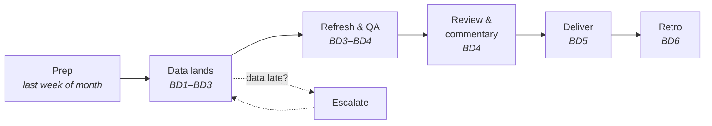
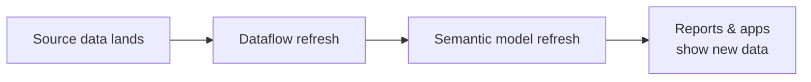

# 05 · Monthly Reporting & Publishing

> **Purpose:** Deliver recurring monthly reports on time and correct, with a predictable cycle that turns late data into early warnings instead of last-minute scrambles.
> **When to use:** Planning and running each monthly cycle, setting up a new recurring report, publishing to the Power BI Service, or troubleshooting refreshes.
> **Related:** [02 Data Modeling](../02-data-modeling/) (model register, refresh schedules) · [04 Validation & QA](../04-validation-qa/) (monthly QA checklist) · [06 Communication](../06-communication/)
> **Last reviewed:** YYYY-MM-DD

---

## Principles

1. **Work backward from the delivery date.** Every step in the cycle has a deadline set by when the report is due.
2. **Know what's needed, from whom, and by when.** Every input has an owner and an expected arrival date.
3. **Escalate early, not late.** A heads-up on day 2 is helpful. A surprise on delivery day damages trust.
4. **Run the same process every month.** Runbooks remove guesswork and make the cycle repeatable when time is short.
5. **Automate the checking, not just the refresh.** A successful refresh doesn't mean correct data.
6. **Improve the cycle a little each month.** A five-minute retro after delivery compounds over a year.

---

## The monthly cycle

Timing is shown in **business days (BD)** relative to month-end. Adjust to match actual close and delivery dates.



### Cycle calendar template

Fill this in once, then reuse it every month.

| When | Step | Details | Done |
|---|---|---|---|
| Last week of month | **Prep** | Confirm delivery dates, check for known data issues, note any report changes requested since last cycle, confirm source owners are available | ☐ |
| BD1–BD3 | **Data readiness** | Track each source in the readiness tracker. Follow up on anything not landed by its expected date. | ☐ |
| BD3 | **Escalation checkpoint** | Anything still missing gets escalated (see below) | ☐ |
| BD3–BD4 | **Refresh** | Refresh Dataflows first, then semantic models. Confirm success in refresh history. | ☐ |
| BD4 | **QA** | Run the [04 monthly QA checklist](../04-validation-qa/). Log results in the QA log. | ☐ |
| BD4 | **Review & commentary** | Explain big swings, write exec takeaways, and do a final review in the Service | ☐ |
| BD5 | **Deliver** | Update apps if needed, send notifications, confirm subscriptions went out | ☐ |
| BD6 | **Retro** | Five-minute retro, and update runbooks and this page | ☐ |

---

## Data readiness tracker

Copy this each month. The expected arrival dates come from the [source notes](../02-data-modeling/) in 02.

```markdown
## Data readiness — [Month YYYY]

| Source | Needed for | Owner | Expected by | Landed | Checked | Notes |
|---|---|---|---|---|---|---|
| ERP sales | Monthly Sales, Exec Summary | | BD2 | ☐ | ☐ | |
| Finance close | Reconciliation baseline | | BD3 | ☐ | ☐ | |
| Targets file | Monthly Sales | | BD1 | ☐ | ☐ | |
```

- **Landed** means the data exists at the source.
- **Checked** means it passed the [Layer 1 source checks](../04-validation-qa/) for freshness, row counts, and duplicates.

---

## Late data: escalation

Late data is normal, but silence about it isn't acceptable. Escalate based on how much buffer is left.

| Situation | Action |
|---|---|
| Source is **1 day late**, buffer remains | Friendly follow-up with the data owner |
| Source is late and **delivery is at risk** | Notify the report's stakeholders with the new expected date, and copy your manager if needed |
| Data **won't arrive in time** | Offer options: deliver on time with a caveat, deliver partial, or move the date |
| Data **arrived but looks wrong** | Hold the report, contact the source owner, and notify stakeholders of the delay |

**Follow-up to the data owner**

```markdown
Hi [Name] — checking on [source/file] for [month]. It's usually available by [date],
and the [report] goes out on [date]. Any update on timing?
```

**Delay notice to stakeholders**

```markdown
Hi [Name] — heads up that the [month] [report] may be delayed.

**Why:** [source] hasn't landed yet (normally available by [date]).
**New expected delivery:** [date]
**Options if you need something sooner:** [e.g., preliminary numbers with a caveat]

I'll confirm as soon as the data arrives.
```

---

## Refresh management

### Refresh order

Dataflows must finish **before** the semantic models that depend on them refresh. Otherwise, the models pull stale data.



**Ways to keep the order right**
- **Schedule with a buffer.** For example, the Dataflow at 5:00 AM and the model at 6:30 AM. Check refresh durations in the history to set the gap.
- **Trigger in sequence.** Use Power Automate to refresh the model when the Dataflow refresh completes. This is more reliable than timed gaps.
- **Refresh manually during close.** For monthly runs, manually refreshing in order after confirming data has landed is often simplest.

### Refresh settings checklist

- [ ] **Refresh failure notifications** turned on for every Dataflow and semantic model
- [ ] Notifications go to an inbox that's actually monitored
- [ ] Gateway (if used) is online, and credentials are current
- [ ] Refresh schedules are recorded in the [model register](../02-data-modeling/)

### Troubleshooting refresh failures

| Error or symptom | Likely cause | Fix |
|---|---|---|
| Credentials error | Password changed or token expired | Update data source credentials in the dataset or Dataflow settings |
| Gateway unreachable | Gateway machine offline or updating | Check the gateway status, and contact whoever manages it |
| Column not found | Source schema changed (renamed or removed column) | Update the Power Query steps, and check with the source owner |
| Timeout | Query too slow, or data volume grew | Check query folding, filter earlier, and consider incremental refresh |
| Refresh succeeded but data is old | Model refreshed before the Dataflow or source updated | Fix the refresh order, then re-run |
| Refresh succeeded but numbers look off | Data issue, not a refresh issue | Go to [04 Validation & QA](../04-validation-qa/) |

---

## Publishing

### Workspace and app basics

- **Workspace** is where content is built and managed. **App** is how most users should consume it.
- Changes to reports in a workspace **don't appear in the app until the app is updated**. Data refreshes appear automatically.
- Keep a consistent structure: a clear workspace per subject area or audience, with consistent report naming (see [02 naming conventions](../02-data-modeling/)).
- Grant access through **app audiences or groups** rather than to individuals, where possible.

### Publishing checklist

- [ ] [04 Validation & QA](../04-validation-qa/) complete for this change or cycle
- [ ] [03 design checklist](../03-report-design/) complete (for new or changed reports)
- [ ] Published to the correct workspace
- [ ] App updated (if report content changed)
- [ ] Access confirmed for the intended audience, and no one unintended
- [ ] Subscriptions and PDF exports checked (if used)
- [ ] Report catalog and change log updated

---

## Delivery

**For each monthly report, confirm:**
- [ ] Headline numbers reconcile (per the QA log)
- [ ] Big month-over-month swings are explained
- [ ] **Exec takeaways** are written (2–3 lines on what changed and why)
- [ ] Last refreshed date is correct
- [ ] Delivery notification sent (if the report isn't auto-subscribed)

**Delivery note template**

```markdown
Hi [Name/team] — the [month] [report] is ready: [link]

**Key takeaways:**
- [Headline metric] was [value], [up/down X%] vs. [comparison]
- [Notable change and why]
- [Anything to watch]

**Notes:** [caveats, restatements, or late data, if any]
```

---

## Report runbook template

Create one runbook per recurring report, stored as `05-monthly-reporting/runbook-[report-name].md`. A good runbook lets someone else run the report if you're out.

```markdown
# Runbook: [Report name]

**Audience:** 
**Delivery date:** BD[X]
**Delivery method:** App / subscription / email / PDF
**Semantic model:** 
**Dataflows:** 
**Reconciliation baseline:** 

## Inputs
| Source | Owner | Expected by | How to check it landed |
|---|---|---|---|

## Steps
1. Confirm all inputs landed (readiness tracker)
2. Refresh [Dataflow] → confirm success
3. Refresh [model] → confirm success
4. Run monthly QA checklist (04)
5. Reconcile [metric] to [baseline]
6. Write takeaways
7. Update app / send delivery note

## Known quirks
- 

## Past issues
| Month | Issue | Resolution |
|---|---|---|
```

---

## Monthly report register

Track every recurring report and its cycle.

```markdown
| Report | Audience | Due (BD) | Key inputs | Baseline | Runbook | Owner/backup |
|---|---|---|---|---|---|---|
```

---

## Monthly retro

Five minutes after each delivery. Add answers to the Lessons list below, or update the relevant runbook.

1. **Was it on time?** If not, which step slipped?
2. **What was late or surprising?** Data, a refresh, or a stakeholder question?
3. **What took longer than it should have?**
4. **What's one change for next month?**

> Track on-time delivery over several months. Patterns (the same source always late, the same step always slow) show where to fix the process.

---

## Lessons
<!-- One line per lesson, newest first. Format: YYYY-MM-DD — what happened → what to do differently -->
