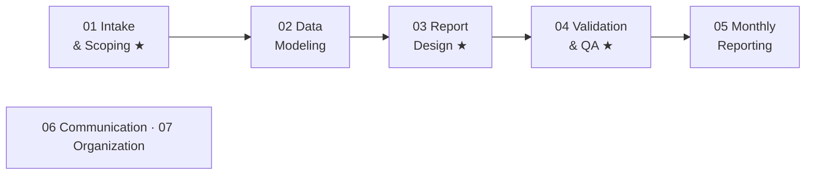

# Data-Science-Analytics-Playbook

> An operating manual for analytics and BI work: how to scope requests, build models and reports, prove the numbers are right, and deliver on time.

---

## What this is

A living reference for analytics/BI work. It combines:

- **Standards and checklists** to use mid-task
- **Templates** to copy and fill in
- **Principles** that guide judgment calls
- **Lessons** captured from real work

The playbook prioritizes being useful over being complete.

**Current focus areas:** ★ Intake & Scoping · ★ Report Design · ★ Validation & QA

---

## How it's organized

The sections follow the workflow from request to delivery, plus two foundations used throughout.

| Section | What's in it | Status |
|---|---|---|
| [Role Expertise Map](role-expertise-map.md) | Skills and tools the role requires, plus a self-assessment | ✅ Drafted |
| [01 Intake & Scoping](01-intake-scoping/) ★ | Turning requests into agreed, well-defined deliverables | ✅ Drafted |
| [02 Data Modeling](02-data-modeling/) | Source data, Power Query, Dataflows, semantic models, DAX | ✅ Drafted |
| [03 Report Design](03-report-design/) ★ | Audience standard and visual design rules for Power BI | ✅ Drafted |
| [04 Validation & QA](04-validation-qa/) ★ | Layered checks, reconciliation, and handling errors | ✅ Drafted |
| [05 Monthly Reporting](05-reporting-and-publishing/) | Monthly calendar, data readiness, runbooks | ⬜ To do |
| [06 Communication](06-communication/) | Stakeholder updates, presenting, handling pushback | ⬜ To do |
| [07 Organization](07-organization/) | Tracking work, prioritizing, documenting | ⬜ To do |
| [templates/](templates/) | Reusable templates pulled out of the sections | ⬜ As needed |
| [assets/](assets/) | Images, diagrams, theme files | ⬜ As needed |

---

## Where to start

| Situation | Go to |
|---|---|
| A new request comes in | [01 Intake & Scoping](01-intake-scoping/) |
| Deciding where logic belongs, or setting up a model | [02 Data Modeling](02-data-modeling/) |
| Designing a report or page | [03 Report Design](03-report-design/) |
| About to publish anything | [04 Validation & QA](04-validation-qa/), then the [03 design checklist](03-report-design/) |
| Starting the monthly cycle | [05 Monthly Reporting](05-monthly-reporting/) and the [04 monthly QA checklist](04-validation-qa/) |
| An error is found after publishing | [04 → When an error gets through](04-validation-qa/) |
| Planning what to learn next | [Role Expertise Map](role-expertise-map.md) |

---

## Maintenance

The playbook is updated **when something breaks or a lesson is learned**, not on a fixed schedule. To keep that easy:

1. **Capture fast.** Drop a one-line note in [`_inbox.md`](_inbox.md) as soon as something happens. No formatting needed.
2. **File it later.** Move inbox notes into the relevant section's **Lessons** list, or update the checklist or template they relate to.
3. **Fix the checklist, not just the incident.** When an error gets through, add the check that would have caught it.
4. **Revisit the expertise map quarterly** to update the self-assessment and choose a focus.

**Page conventions**
- Every section page starts with **Purpose / When to use / Related / Last reviewed**.
- Every section page ends with a **Lessons** list: `YYYY-MM-DD — what happened → what to do differently`.
- Keep pages short. If a template gets copied often, move it to `templates/` and link to it.

---

## Out of scope (for now)

Deep ML and statistical modeling, people management, and team-wide standards. These can be added later if the role or direction changes.
