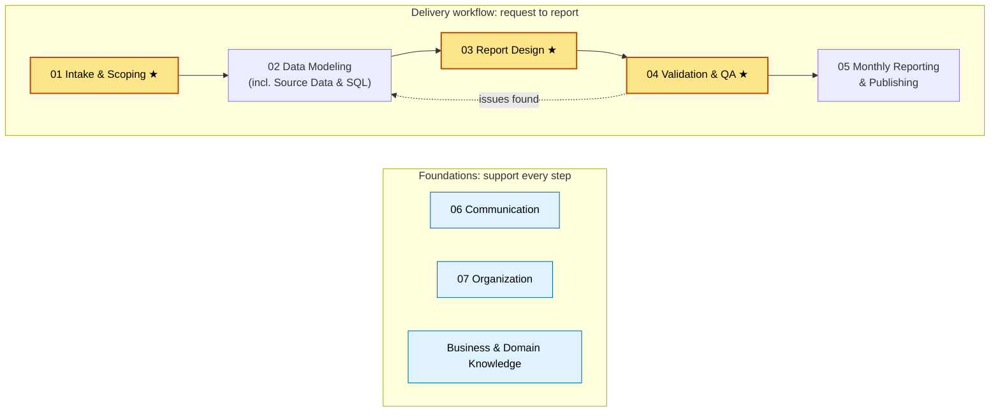

# Role Expertise Map

> **Purpose:** Define the areas of expertise my analytics/BI role requires, the skills and tools behind each, and where I stand today.
> **When to use:** Quarterly self-check, when planning what to learn next, or when prepping for a review.
> **Last reviewed:** YYYY-MM-DD

---

## At a glance

Areas are numbered to match the playbook folders, so **02 on this page = the `02-data-modeling` folder**.

**Legend:** Yellow ★ = current improvement priority · Blue = foundational skills used throughout · Dotted arrow = QA findings loop back to the model.

---

## How to read this page

Each area includes a short definition, what "good" looks like in my role, the core skills, the tools I use, and a link to its playbook section. The self-assessment table at the bottom tracks my current and target level for each area.

**Proficiency scale**

| Level | Name | Meaning |
|---|---|---|
| 1 | Aware | I know what it is and when it applies, but need help to do it. |
| 2 | Working | I can do it on routine tasks, with occasional lookups. |
| 3 | Proficient | I do it independently and reliably, including non-routine cases. |
| 4 | Advanced | I set the standard, troubleshoot hard cases, and can teach it. |

---

## 01 · Intake & Scoping ★ priority

**Definition:** Turning a request into a clearly defined deliverable before building anything.

**What good looks like:** I can name the decision a report supports, who will use it, how "done" is defined, and whether existing models already cover it — before I open Power BI.

**Core skills**
- Asking "what decision will this support?" and uncovering the need behind the request
- Sizing requests (quick fix / small / project) and matching intake depth to size
- Defining metrics precisely (grain, filters, time logic, edge cases)
- Checking for reuse against existing reports, models, and measures
- Negotiating scope, priority, and scope changes

**Tools:** Intake template, metric definition block, scope confirmation note, task tracker

**Playbook section:** [01-intake-scoping](01-intake-scoping/)

---

## 02 · Data Modeling (incl. Source Data & SQL)

**Definition:** Understanding where data comes from and building the transformation and model layers that reports sit on.

**What good looks like:** I know the key source systems and their quirks. Models are star schemas with clear relationships, logic sits in the right layer, and someone else could understand my Power Query steps and measures.

**Core skills: source data & SQL**
- SQL: joins, aggregations, CTEs, window functions
- Understanding source tables, keys, grain, and update timing
- Profiling data (nulls, duplicates, unexpected values)

**Core skills: modeling**
- Power Query (M): shaping, merging, parameters, query folding
- Dataflows: centralizing reusable transformation logic
- Semantic models: star schema, relationships, date tables, field list hygiene
- DAX: measures, filter context, time intelligence
- Deciding where logic belongs: source vs. Dataflow vs. Power Query vs. DAX
- Naming conventions, model register, and change log

**Tools:** SQL (SSMS or VS Code), Power BI Desktop, Power Query, Dataflows, DAX, Tabular Editor, DAX Studio

**Playbook section:** [02-data-modeling](02-data-modeling/) (source notes and model register live here too)

---

## 03 · Report Design ★ priority

**Definition:** Building Power BI reports that fit the audience viewing them.

**What good looks like:** Every report follows my audience standard. Executives get the answer in seconds, managers and operators can see where to act, and analysts can explore.

**Core skills**
- Designing for audience type: Executive, Manager / Operator, Analyst
- Choosing the right chart for the question
- Consistent formatting through a theme file (colors, fonts, number formats)
- Interactivity: slicers, drill-through, tooltips, bookmarks
- Accessibility: contrast, alt text, tab order, not relying on color alone

**Tools:** Power BI Desktop, report theme file (JSON), pre-publish design checklist, report catalog

**Playbook section:** [03-report-design](03-report-design/)

---

## 04 · Validation & QA ★ priority

**Definition:** Proving the numbers are right before anyone else sees them.

**What good looks like:** Every change passes QA matched to its size, results reconcile to a trusted number, and I catch issues before stakeholders do.

**Core skills**
- Checking all six layers: source, transform, model, report, reconciliation, sense check
- Reconciling to a trusted baseline within an agreed tolerance
- Tracing an issue back to the layer where it started
- Documenting checks in the QA log
- Handling and communicating errors that get through

**Tools:** SQL, Power Query column profiling, DAX Studio, Excel (reconciliation), refresh history, QA log

**Playbook section:** [04-validation-qa](04-validation-qa/)

---

## 05 · Monthly Reporting & Publishing

**Definition:** Running recurring reporting reliably and on time, and publishing work to the people who need it.

**What good looks like:** Monthly reports go out on schedule. I know what data I need and when, and late data triggers a clear escalation instead of a scramble.

**Core skills**
- Planning a monthly calendar that works backward from delivery dates
- Tracking data readiness and escalating late or bad data early
- Managing scheduled refresh and troubleshooting refresh failures
- Publishing to workspaces and apps, and managing access
- Maintaining a runbook for each recurring report

**Tools:** Power BI Service (workspaces, apps, scheduled refresh, gateways), calendar, runbooks

**Playbook section:** [05-reporting-and-publishing](05-reporting-and-publishing/)

---

## 06 · Communication

**Definition:** Making sure the right people understand the work, its status, and what the numbers mean.

**What good looks like:** Stakeholders are never surprised. I explain findings in business terms and handle "the numbers look wrong" calmly and with evidence.

**Core skills**
- Tailoring the message to executives, managers, and operational teams
- Writing clear status updates, delay notices, and error notifications
- Presenting findings and walking through reports
- Handling data disputes and pushback
- Setting and resetting expectations on timelines

**Tools:** Email and Teams, scope confirmation and notification templates

**Playbook section:** [06-communication](06-communication/)

---

## 07 · Organization

**Definition:** Keeping my work visible, prioritized, and findable.

**What good looks like:** Every request is tracked, I know my priorities each week, and I can find any past query, definition, or decision quickly.

**Core skills**
- Tracking requests from intake to delivery
- Prioritizing across competing requests
- Documenting as I go (definitions, decisions, handoff notes)
- Consistent file, workspace, and report naming
- Maintaining this playbook through the inbox and Lessons sections

**Tools:** Task tracker, this playbook (GitHub), `_inbox.md`

**Playbook section:** [07-organization](07-organization/)

---

## Foundation · Business & Domain Knowledge

**Definition:** Understanding the business well enough to know which numbers matter and when something looks off.

**What good looks like:** I understand each team's key metrics and goals, and can sanity-check a number against how the business actually works.

**Core skills**
- Knowing each stakeholder team's goals and KPIs
- Understanding business processes behind the data
- Recognizing seasonality and normal ranges for key metrics

**Tools:** Stakeholder notes, metric definitions log

**Playbook section:** No folder of its own. It shows up in intake (finding the real need) and QA (the Layer 6 sense check).

---

## Self-Assessment

| Area | Current (1–4) | Target (1–4) | Evidence / next step |
|---|---|---|---|
| 01 Intake & Scoping ★ | | | |
| 02 Data Modeling: Source Data & SQL | | | |
| 02 Data Modeling: Power Query, Dataflows, DAX | | | |
| 03 Report Design ★ | | | |
| 04 Validation & QA ★ | | | |
| 05 Monthly Reporting & Publishing | | | |
| 06 Communication | | | |
| 07 Organization | | | |
| Foundation: Business & Domain Knowledge | | | |

**Focus for this quarter:** _Pick one or two areas where the gap between current and target matters most._

---

## Lessons
<!-- Add one-line notes here when you learn something about the skills your role needs. -->
