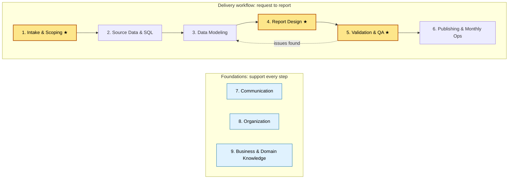

# Role Expertise Map

> **Purpose:** Define the areas of expertise my analytics/BI role requires, the skills and tools behind each, and where I stand today.
> **When to use:** Quarterly self-check, when planning what to learn next, or when prepping for a review.
> **Last reviewed:** YYYY-MM-DD

---

## At a glance

**Legend:** Yellow ★ = current improvement priority · Blue = foundational skills used throughout · Dotted arrow = QA findings loop back to the model.

---

## How to read this page

Each area includes a short definition, what "good" looks like in my role, the core skills, and the tools I use. The self-assessment table at the bottom tracks my current and target level for each area.

**Proficiency scale**

| Level | Name | Meaning |
|---|---|---|
| 1 | Aware | I know what it is and when it applies, but need help to do it. |
| 2 | Working | I can do it on routine tasks, with occasional lookups. |
| 3 | Proficient | I do it independently and reliably, including non-routine cases. |
| 4 | Advanced | I set the standard, troubleshoot hard cases, and can teach it. |

---

## 1. Intake & Scoping ★ priority

**Definition:** Turning a request into a clearly defined deliverable before building anything.

**What good looks like:** I can name the decision a report supports, who will use it, how "done" is defined, and whether existing models already cover it — before I open Power BI.

**Core skills**
- Asking "what decision will this support?" and uncovering the need behind the request
- Defining metrics precisely (grain, filters, time logic, edge cases)
- Estimating effort and negotiating scope or priority
- Recognizing when a request duplicates an existing report or metric

**Tools:** Intake template (`templates/`), metric definitions log, task tracker

**Playbook section:** [01-intake-scoping](01-intake-scoping/)

---

## 2. Source Data & SQL

**Definition:** Understanding where data comes from and retrieving it correctly.

**What good looks like:** I know the key source systems, their refresh timing, and their quirks, and I can write SQL to explore, extract, or check data.

**Core skills**
- SQL: joins, aggregations, CTEs, window functions
- Understanding source system tables, keys, and grain
- Knowing when and how each source updates
- Profiling data (nulls, duplicates, unexpected values)

**Tools:** SQL (SSMS or VS Code), Excel, SharePoint/file sources, source system documentation

**Playbook section:** [02-data-modeling](02-data-modeling/) (source notes)

---

## 3. Data Modeling

**Definition:** Building the transformation and model layers that reports sit on.

**What good looks like:** Models are star schemas with clear relationships, logic sits in the right layer, and someone else could understand my Power Query steps and measures.

**Core skills**
- Power Query (M): shaping, merging, parameterizing, query folding awareness
- Dataflows: centralizing reusable transformation logic
- Semantic models: star schema design, relationships, cardinality, date tables
- DAX: measures, `CALCULATE` and filter context, time intelligence
- Deciding where logic belongs: Dataflow vs. semantic model vs. DAX measure
- Naming and documentation conventions

**Tools:** Power BI Desktop, Power Query, Dataflows, DAX, Tabular Editor, DAX Studio

**Playbook section:** [02-data-modeling](02-data-modeling/)

---

## 4. Report Design & Visualization ★ priority

**Definition:** Building Power BI reports that fit the audience viewing them.

**What good looks like:** Every report follows my audience standard. Executives get the answer in seconds, managers can monitor and drill down, and analysts can explore.

**Core skills**
- Designing for audience type (layout, visual count, level of detail)
- Choosing the right chart for the question
- Consistent formatting: themes, colors, titles, number formats
- Interactivity: slicers, drill-through, tooltips, bookmarks
- Accessibility: contrast, alt text, readable fonts

**Tools:** Power BI Desktop, report theme file (JSON), audience standard checklist (`templates/`)

**Playbook section:** [03-report-design](03-report-design/)

---

## 5. Validation & QA ★ priority

**Definition:** Proving the numbers are right before anyone else sees them.

**What good looks like:** Every report and monthly refresh passes a layered checklist, reconciles against a trusted number, and I catch issues before stakeholders do.

**Core skills**
- Source checks: row counts, freshness, completeness
- Model checks: relationship behavior, totals vs. source, blank or unmatched keys
- Report checks: filter behavior, edge cases, "does this look wrong?" review
- Reconciling to a known number (finance totals, prior month, source system)
- Documenting what was checked and when

**Tools:** SQL, DAX Studio, Excel (reconciliation), Power BI refresh history, QA checklist and reconciliation log (`templates/`)

**Playbook section:** [04-validation-qa](04-validation-qa/)

---

## 6. Publishing & Monthly Operations

**Definition:** Running recurring reporting reliably and on time.

**What good looks like:** Monthly reports go out on schedule. I know what data I need and when, and late data triggers a clear escalation instead of a scramble.

**Core skills**
- Planning a monthly calendar that works backward from delivery dates
- Managing scheduled refresh and troubleshooting refresh failures
- Publishing to workspaces and apps and managing access
- Running and maintaining a runbook for each recurring report
- Escalating late or bad data early

**Tools:** Power BI Service (workspaces, apps, scheduled refresh, gateways), calendar, runbooks (`05-monthly-reporting/`)

**Playbook section:** [05-monthly-reporting](05-monthly-reporting/)

---

## 7. Communication

**Definition:** Making sure the right people understand the work, its status, and what the numbers mean.

**What good looks like:** Stakeholders are never surprised. I explain findings in business terms and handle "the numbers look wrong" calmly and with evidence.

**Core skills**
- Tailoring the message to execs, managers, and operational teams
- Writing clear status updates and delay notices
- Presenting findings and walking through reports
- Handling data disputes and pushback
- Setting and resetting expectations on timelines

**Tools:** Email and Teams, status and delay templates (`templates/`)

**Playbook section:** [06-communication](06-communication/)

---

## 8. Organization

**Definition:** Keeping my work visible, prioritized, and findable.

**What good looks like:** Every request is tracked, I know my priorities each week, and I can find any past query, definition, or decision quickly.

**Core skills**
- Tracking requests from intake to delivery
- Prioritizing across competing requests
- Documenting as I go (definitions, decisions, handoff notes)
- Consistent file, workspace, and report naming

**Tools:** Task tracker, this playbook (GitHub), `_inbox.md`

**Playbook section:** [07-organization](07-organization/)

---

## 9. Business & Domain Knowledge

**Definition:** Understanding the business well enough to know which numbers matter and when something looks off.

**What good looks like:** I understand each team's key metrics and goals, and can sanity-check a number against how the business actually works.

**Core skills**
- Knowing each stakeholder team's goals and KPIs
- Understanding business processes behind the data
- Recognizing seasonality and normal ranges for key metrics

**Tools:** Stakeholder notes, metric definitions log

**Playbook section:** Cross-cutting (feeds intake and QA)

---

## Self-Assessment

| # | Area | Current (1–4) | Target (1–4) | Evidence / next step |
|---|---|---|---|---|
| 1 | Intake & Scoping ★ | | | |
| 2 | Source Data & SQL | | | |
| 3 | Data Modeling | | | |
| 4 | Report Design & Visualization ★ | | | |
| 5 | Validation & QA ★ | | | |
| 6 | Publishing & Monthly Operations | | | |
| 7 | Communication | | | |
| 8 | Organization | | | |
| 9 | Business & Domain Knowledge | | | |

**Focus for this quarter:** _Pick one or two areas where the gap between current and target matters most._

---

## Lessons
<!-- Add one-line notes here when you learn something about the skills your role needs. -->
